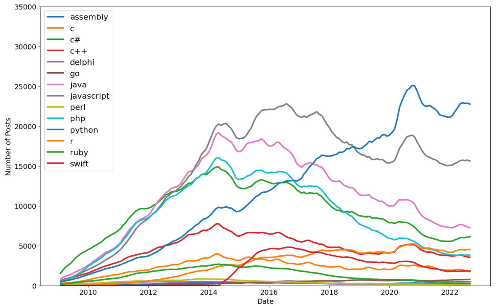

# 02_Analyse_Popularity_of_Programming_Languages

Each post on Stack Overflow comes with a tag. And this tag can be the name of a programming language. Based on that, we will gather data from stackoverflow and generate a csv file containing information on various programming languages and
the number of times each language is tagged in a post. This will help us to determine which programming language is the most popular.
The analysis is carried out using the Python Library Pandas, and the results are plotted using the Python Library Matplotlib. 

---

Useful Links:

Pandas  
https://pandas.pydata.org/pandas-docs/stable/index.html  

Jupyter Notebook 
https://jupyter.org/ 

---

The necessary steps to make the program work: 
1. Install the required libraries from the requirements.txt using the following command:  
*pip install -r requirements.txt* 
2. Explore data in the main.ipynb where Python code can be run in blocks. 
3. Using Colab from google https://research.google.com/colaboratory/faq.html explore data from main.ipynb. 

---

**Example view:** 

 
 

***End result:***
 

 

--- 

**The program was developed using python 3.11.0, Pandas 1.5.1, Matplotlib, Jupyter-Notebook**

In order to run the program, open main.ipynb and install the required add-ons.
