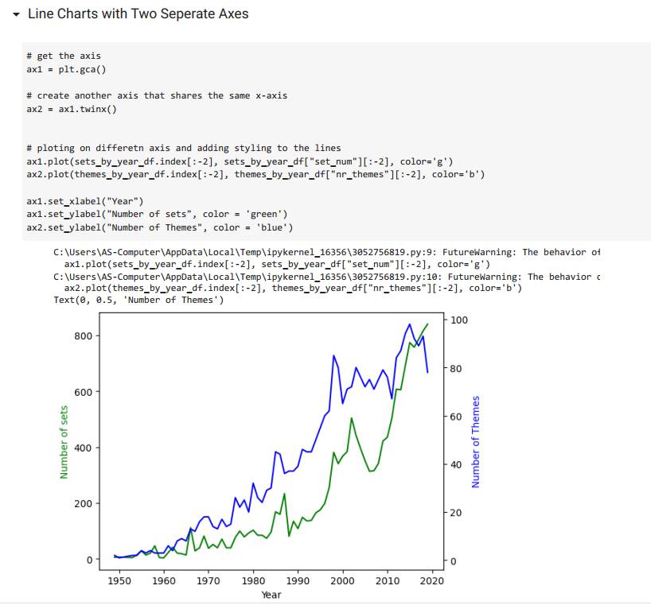
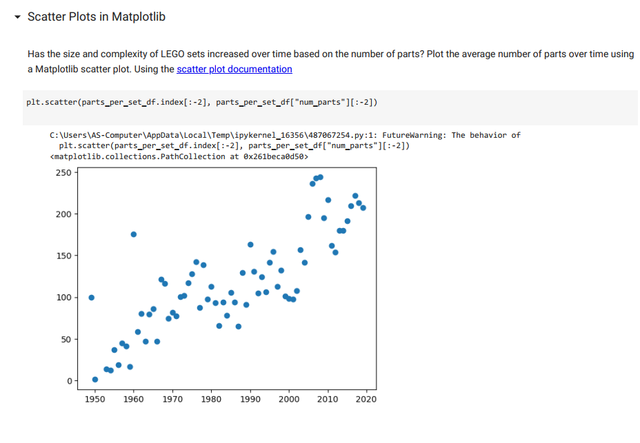
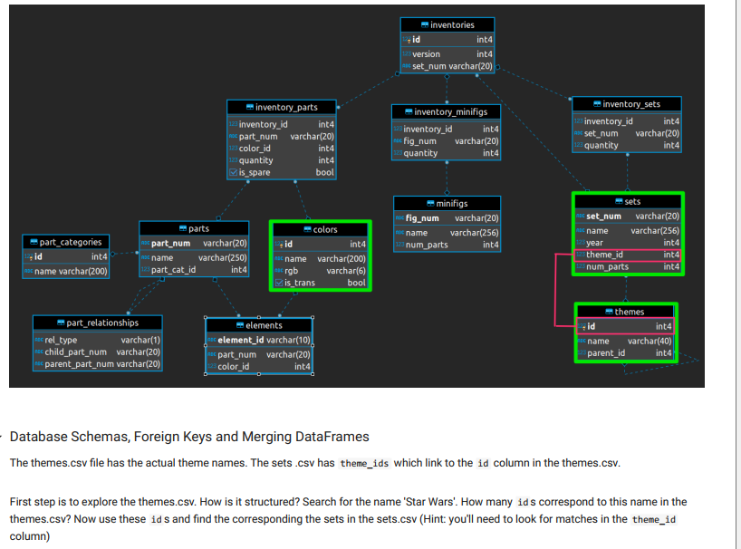
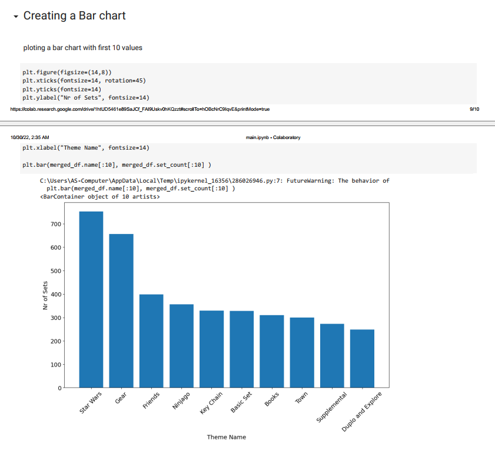

# 03_Analysing_Dataset_LEGO_Pieces

The data for LEGO pieces was used from https://rebrickable.com/downloads/ (like colors.csv, sets.csv, and themes.csv).
The analysis is carried out using the Python Library Pandas, and the results are plotted using the Python Library Matplotlib. Some examples of how to use a relational database and merge columns were described in this analysis.
Some very interesting facts could be found thanks to this analysis, like the most enormous Lego set ever or how many pieces did it have? Or, when were the first LEGO sets released, and how many sets did the company sell when it first opened its doors? Or we can explore which LEGO theme is the most popular. By analysing the data, we can see when the company really took off based on its product offering. We can also answer questions like whether LEGO complexity has changed over time, or which sets tend to have more parts. 

---

Useful Links:
 
Pandas  
https://pandas.pydata.org/pandas-docs/stable/index.html  

Jupyter Notebook 
https://jupyter.org/ 

---

The necessary steps to make the program work: 
1. Install the required libraries from the requirements.txt using the following command:  
*pip install -r requirements.txt* 
2. Explore data in the main.ipynb where Python code can be run in blocks. 
3. Using Colab from google https://research.google.com/colaboratory/faq.html explore data from main.ipynb. 

---

**Example view:** 

 
 

***Some examples from the analysis of LEGO:*** 
 

 

 

 

 

---

**The program was developed using python 3.11.0, Pandas 1.5.1, Matplotlib, Jupyter-Notebook**

In order to run the program, open main.ipynb and install the required add-ons.
