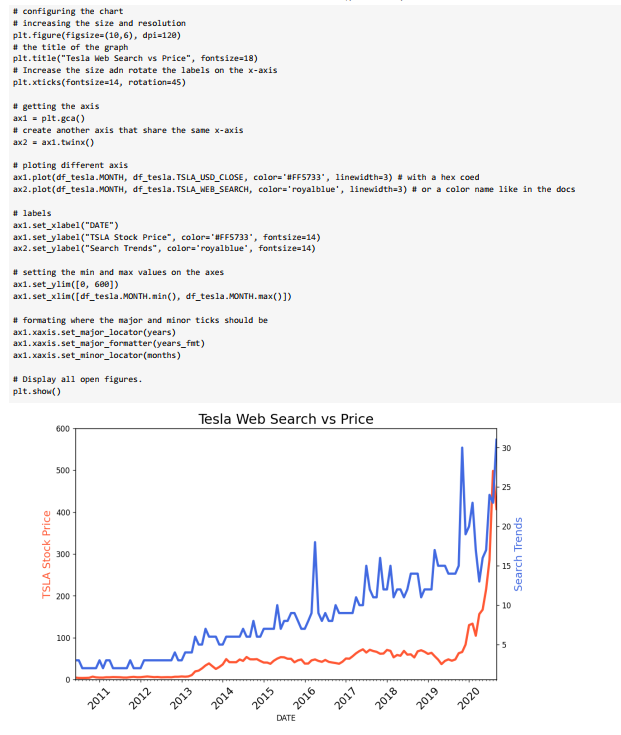
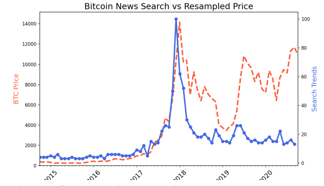
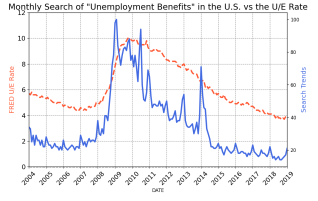
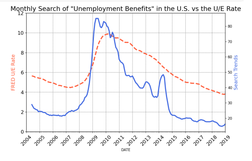

# 04_Combine_Google_Trends_with_other_Data

This analysis shows how to combine Google trends with web searches from https://trends.google.com/trends in comparison to some other data. The popularity of search terms can tell us a lot about future trends. In this particular example, three main data sets were examined. 
1. Bitcoin search volume in comparison to Bitcoin prices 
2. The relationship between Tesla's stock price and Tesla search volume 
3. Unemployment Rate vs. Unemployment Benefits Search Volume 
For getting the bitcoin, the Tesla stock price, https://finance.yahoo.com/quote was used.
For getting the unemployment rate,https://fred.stlouisfed.org/series/UNRATE/ was used.
In order to match the data, resampling of dates and time series was necessary.

---

Useful Links:

Pandas  
https://pandas.pydata.org/pandas-docs/stable/index.html  

Jupyter Notebook 
https://jupyter.org/ 

---

The necessary steps to make the program work: 
1. Install the required libraries from the requirements.txt using the following command:  
*pip install -r requirements.txt* 
2. Explore data in the main.ipynb where Python code can be run in blocks. 
3. Using Colab from google https://research.google.com/colaboratory/faq.html explore data from main.ipynb. 

---

**Example view:** 

 
 

***Some examples from the analysis:*** 
 

 

 

 

 

---

**The program was developed using python 3.11.0, Pandas 1.5.1, Matplotlib, Jupyter-Notebook**

In order to run the program, open main.ipynb and install the required add-ons.
