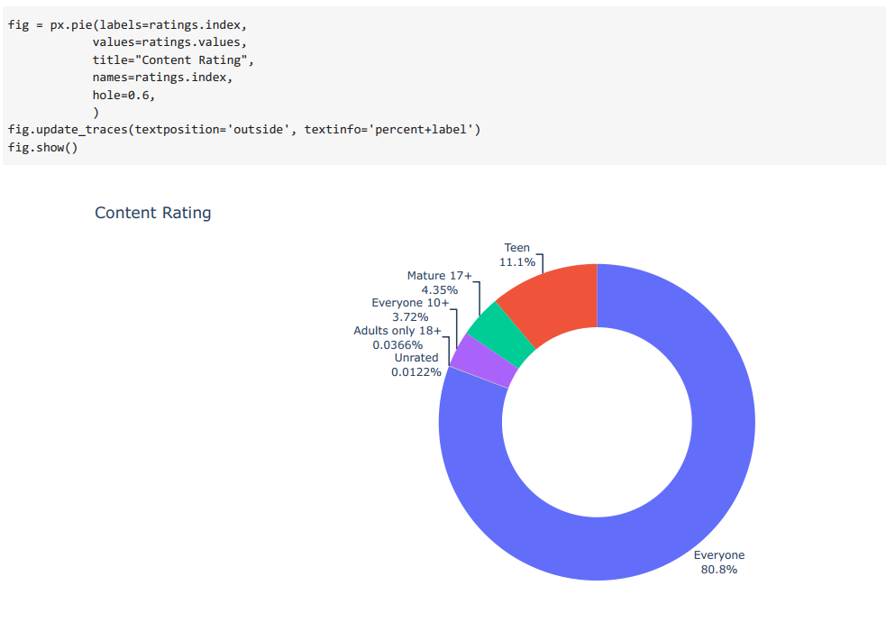
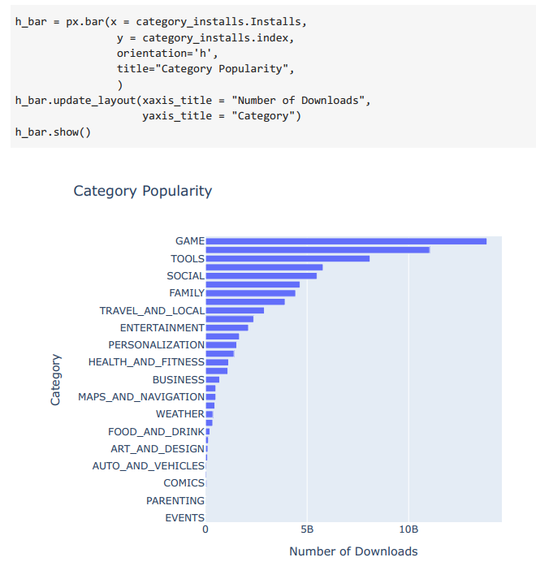
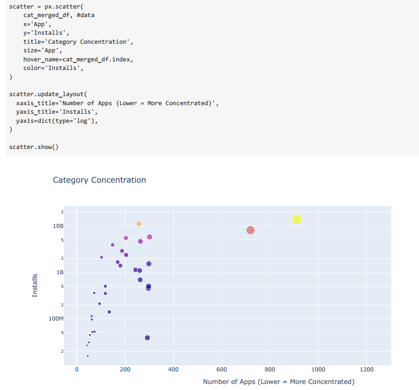
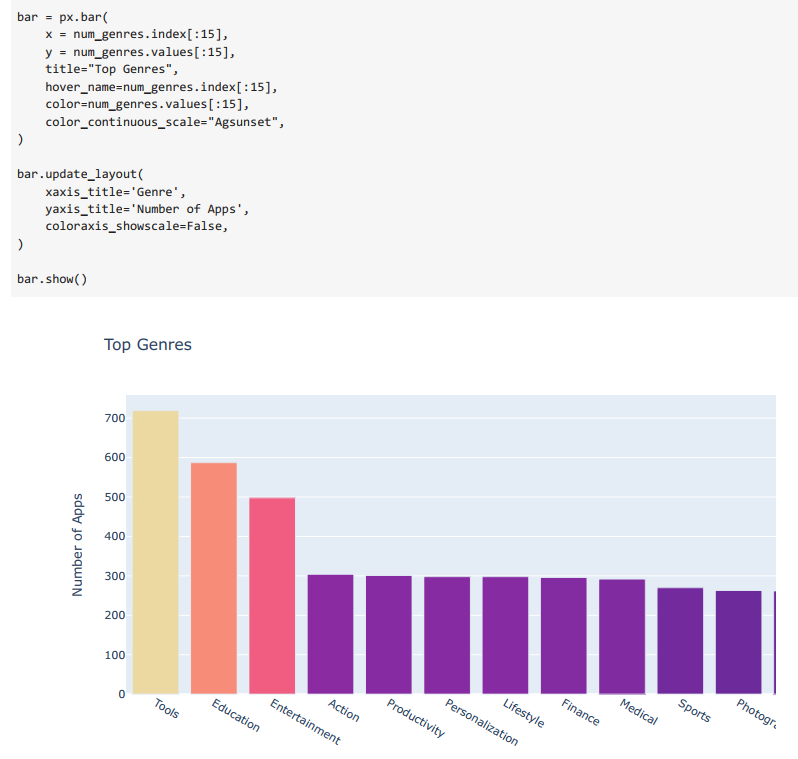
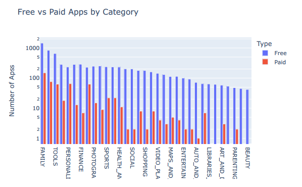
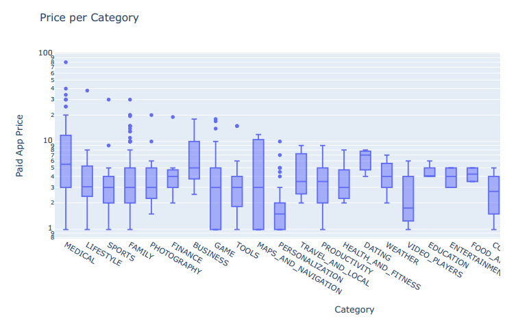

# 05_Analysing_Google_Apps_Plotly

This analysis focuses on data about Google apps scraped from the Google Play Store by Lavanya Gupta in 2018. The original files are available [here] (https://www.kaggle.com/lava18/google-play-store-apps).
The main points were depicting interesting facts about Google Apps with the help of Python libry plotly, and
using diverse charts, like pie, bar, box, and many more. 
The data about Google apps was explored to find out interesting facts like: 
* how competitive various app categories (for example, games, lifestyle, and weather) are, 
* What are the most popular apps, 
* What was the most downloaded app's estimated revenue, 
* how the monetization of an app affects its download count, 
* What is a reasonable price for an app, 

---

Useful Links:

Pandas  
https://pandas.pydata.org/pandas-docs/stable/index.html  

Jupyter Notebook 
https://jupyter.org/ 

---

The necessary steps to make the program work: 
1. Install the required libraries from the requirements.txt using the following command:  
*pip install -r requirements.txt* 
2. Explore data in the main.ipynb where Python code can be run in blocks. 
3. Using Colab from google https://research.google.com/colaboratory/faq.html explore data from main.ipynb. 

---

**Example view:** 

 
 

***Some examples from the analysis of LEGO:*** 
 

 

 

 

 

 

 

---

**The program was developed using python 3.11.0, Pandas 1.5.1, Matplotlib, Jupyter-Notebook**

In order to run the program, open main.ipynb and install the required add-ons.