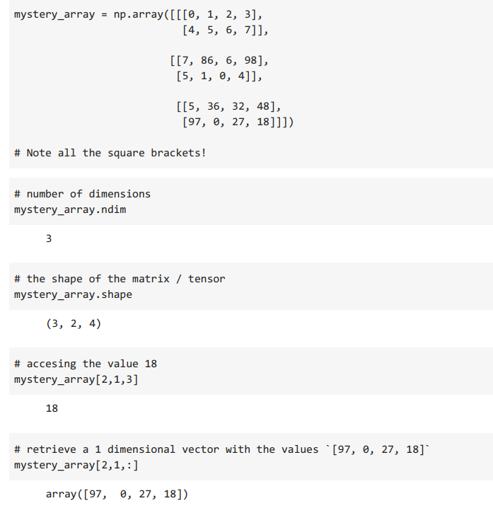
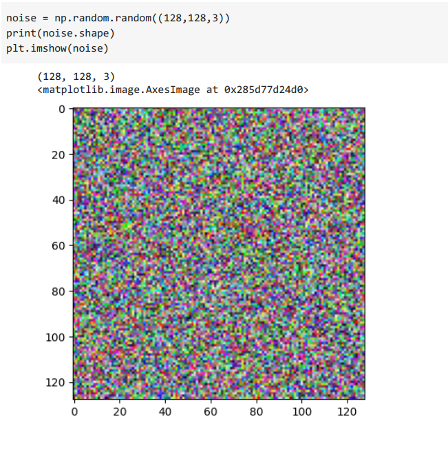
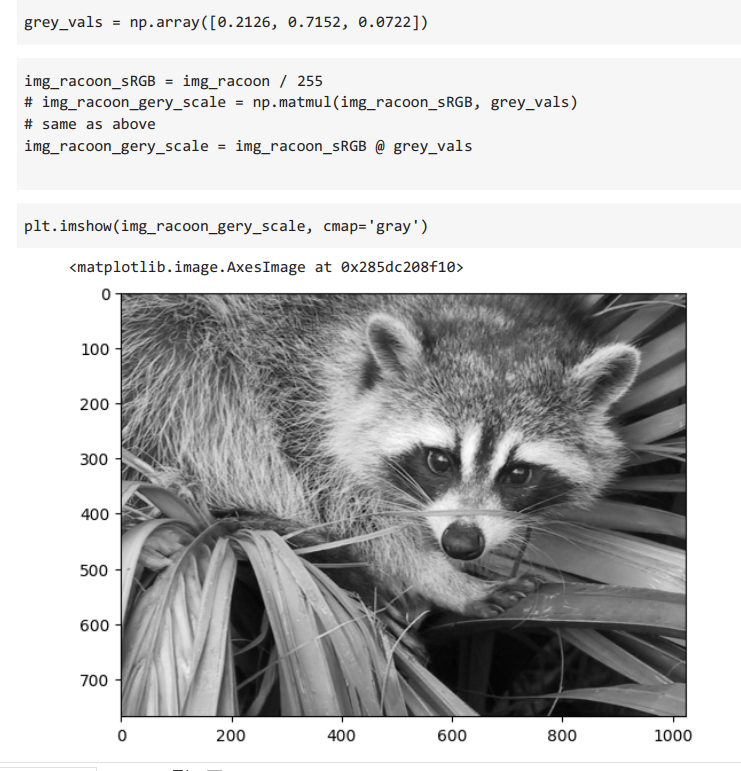

# 06_NumPy_and_N_Dimensional_Arrays
In this project we will explore the NumPy (Numerical Python) Python library, which is
used in almost every field of science and engineering. It’s practically the standard for working with numerical data in Python. It is an introduction to get a better understanding of how to work with this library. 
Main points, including: 
* how to work with arrays 
* how to create nd.arrays 
* creating arrays with standard functions such as arange(), random(), or linespace() 
* What exactly is broadcasting and how does it work 
* How to do linear algebra with NumPy 
* Image manipulation with a NumPy array   

---

Useful Links:

Pandas  
https://pandas.pydata.org/pandas-docs/stable/index.html  

Jupyter Notebook 
https://jupyter.org/ 

NumPy
https://numpy.org/doc/stable/index.html 

---

The necessary steps to make the program work: 
1. Install the required libraries from the requirements.txt using the following command:  
*pip install -r requirements.txt* 
2. Explore data in the main.ipynb where Python code can be run in blocks. 
3. Using Colab from google https://research.google.com/colaboratory/faq.html explore data from main.ipynb. 

---

**Example view:** 

 
 

***Overview:*** 
 

 

 

 

---

**The program was developed using python 3.11.0, Pandas 1.5.1, Matplotlib, Jupyter-Notebook**

In order to run the program, open main.ipynb and install the required add-ons.