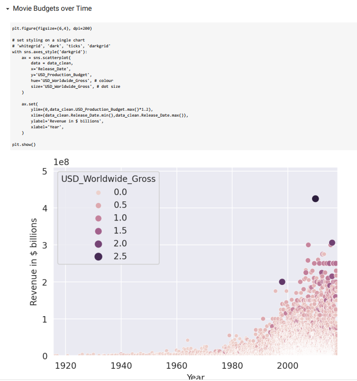

# 07_Seaborn_and_Linear_Regression

This project will have a focus on analysing data about films. Data was scraped on May 1, 2018 from
https://www.the-numbers.com/movie/budgets .In this analysis, we will explore the different aspects of how the budget of a movie influences the revenue, and also how to predict future revenue based on the budget and year it was filmed.
Different Python libraries were used. like the visualisation library [Seaborn](https://seaborn.pydata.org/index.html), which is based on Matplotlib for generating different kinds of charts (bubble chart, scatter chart, regressions). as well as the open source data analysis library [scikit-learn](https://scikit-learn.org/stable/) (the gold standard for machine learning), which was used to calculate the data for linear regression, check how accurate our model is, and make predictions about future revenue.

---

Useful Links:

Pandas  
https://pandas.pydata.org/pandas-docs/stable/index.html  

Jupyter Notebook 
https://jupyter.org/ 

NumPy
https://numpy.org/doc/stable/index.html 

scikit-learn
https://scikit-learn.org/stable/ 

seaborn
https://seaborn.pydata.org/index.html

---

The necessary steps to make the program work: 
1. Install the required libraries from the requirements.txt using the following command:  
*pip install -r requirements.txt* 
2. Explore data in the main.ipynb where Python code can be run in blocks. 
3. Using Colab from google https://research.google.com/colaboratory/faq.html explore data from main.ipynb. 

---

**Example view:** 

 
 

***Overview:*** 
 

 

 

 

---

**The program was developed using python 3.11.0, Pandas 1.5.1, NumPy, Matplotlib, scikit-learn, seaborn, Jupyter-Notebook**

In order to run the program, open main.ipynb and install the required add-ons.
