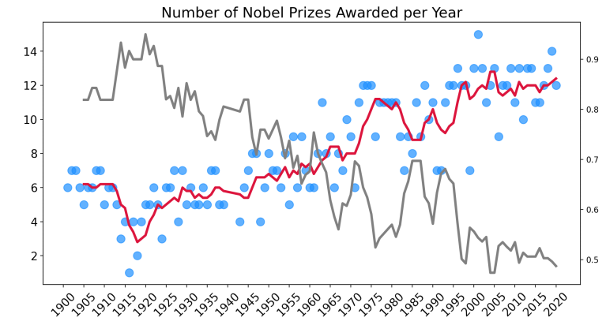

# 08_Nobel_Prize_Analysis

In this project, we're going to analyse data (https://www.nobelprize.org/prizes/lists/all-nobel-prizes/) on the past winners of the Nobel Prize. Thanks to this analysis, we will find some interesting facts about the Nobel laureates, like:
The ratio of male to female winners, or who was the first to win a Nobel Prize, how many people got a Nobel Prize more than once, how many categories there are and how many prizes there are for each category, the number of Nobel Prizes awarded over time, which countries have the most Nobel Prizes, which cities make the most discoveries, where are the Nobel laureates born? What are the patterns or statistics in the laureates' age at the time of the award? 
There were different Python libraries used in order to better visualise the results.
[Seaborn](https://seaborn.pydata.org/index.html), which is based on Matplotlib for generating different kinds of charts (bubble chart, scatter chart, box charts, regressions).
[Plotly](https://plotly.com/python/), it's Python graphing library, makes interactive, publication-quality graphs (like sunbursts and choropleths).
[Matplotlib](https://matplotlib.org/) is a comprehensive library for creating static, animated, and interactive visualisations in Python. Matplotlib makes easy things easy and hard things possible.

---

Useful Links:

Pandas  
https://pandas.pydata.org/pandas-docs/stable/index.html  

Jupyter Notebook 
https://jupyter.org/ 

NumPy
https://numpy.org/doc/stable/index.html 

scikit-learn
https://scikit-learn.org/stable/index.html 

seaborn
https://seaborn.pydata.org/index.html

Plotly
https://plotly.com/python/

Matplotlib
https://matplotlib.org/stable/

---

The necessary steps to make the program work: 
1. Install the required libraries from the requirements.txt using the following command:  
*pip install -r requirements.txt* 
2. Explore data in the main.ipynb where Python code can be run in blocks. 
3. Using Colab from google https://research.google.com/colaboratory/faq.html explore data from main.ipynb. 

---

**Example view:** 

 
 

***Overview:*** 
 

 

 

 

 

 

 

 

 

 

---

**The program was developed using python 3.11.0, Pandas 1.5.1, NumPy, Matplotlib, scikit-learn, seaborn, plotly, Jupyter-Notebook**

In order to run the program, open main.ipynb and install the required add-ons.
