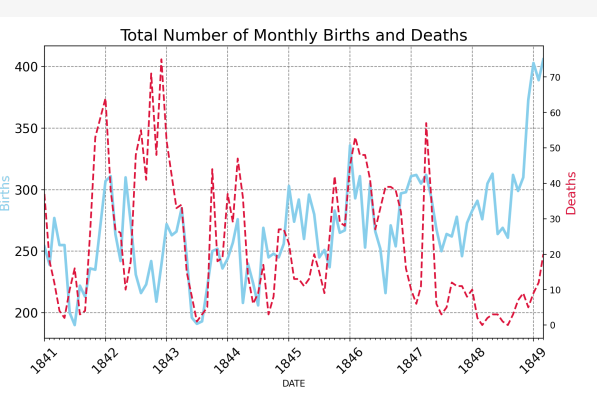
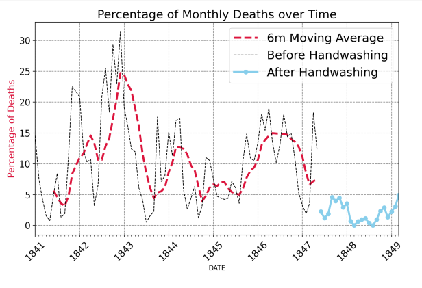
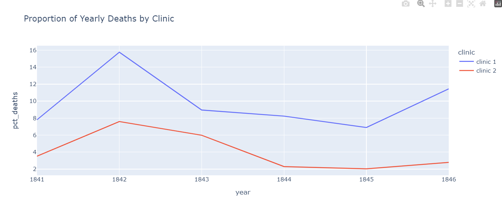
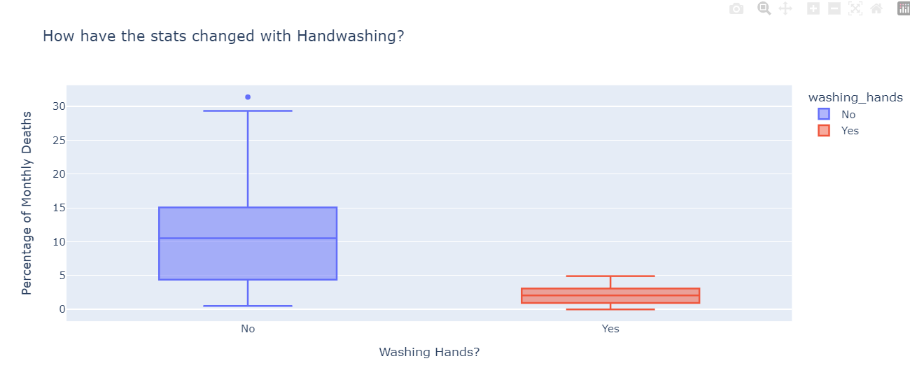
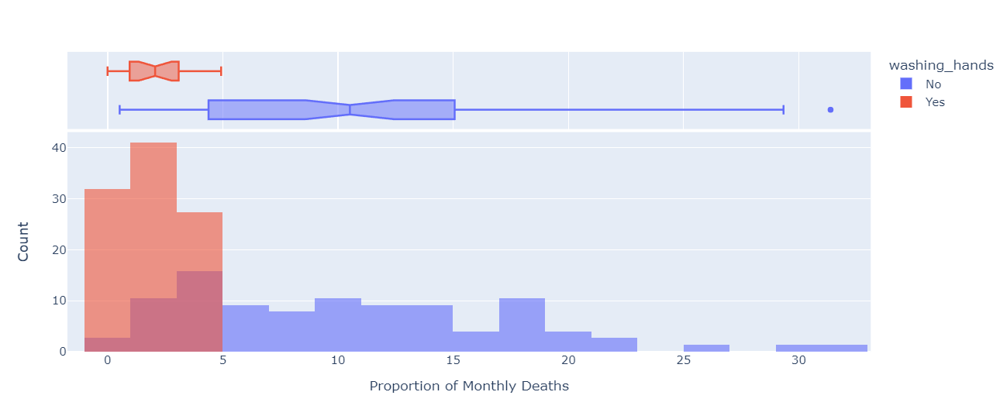
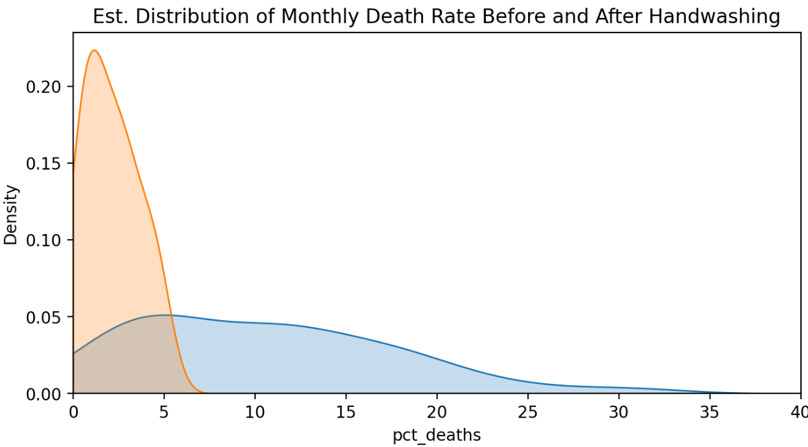

# 09_Hospital_Birth_Deaths_Analysis

In this project, we're going to analyse data (http://graphics8.nytimes.com/images/blogs/freakonomics/pdf/the%20etiology,%20concept%20and%20prophylaxis%20of%20childbed%20fever.pdf) that was collected by Dr. Semmelweis in the 1800s on deaths of women in maternity wards from childbed fever. Some highlights from the analysis include,
percentage of women dying in childbirth, visualising the total number of births and deaths over time.
And we will also look more closely into the effect of handwashing, calculating the difference in the average monthly death rate based on handwashing and using histograms to visualise the monthly distribution of outcomes (percentage of deaths). 
The main libraries used in this analysis were: 
[Seaborn](https://seaborn.pydata.org/index.html), which is based on Matplotlib for generating different kinds of charts. 
[Plotly](https://plotly.com/python/), it's Python graphing library, makes interactive, publication-quality graphs. 
[Matplotlib](https://matplotlib.org/) is a comprehensive library for creating static, animated, and interactive visualisations in Python. 
[SciPy](https://docs.scipy.org/doc/scipy/index.html) is an open-source software for mathematics, science, and engineering (for calculating the t-statistic and the p-value). 

---

Useful Links:

Pandas  
https://pandas.pydata.org/pandas-docs/stable/index.html  

Jupyter Notebook 
https://jupyter.org/ 

NumPy
https://numpy.org/doc/stable/index.html 

scikit-learn 
https://scikit-learn.org/stable/index.html 

SciPy 
https://docs.scipy.org/doc/scipy/getting_started.html 

seaborn 
https://seaborn.pydata.org/index.html 

Plotly 
https://plotly.com/python/ 

Matplotlib 
https://matplotlib.org/stable/ 

---

The necessary steps to make the program work: 
1. Install the required libraries from the requirements.txt using the following command:  
*pip install -r requirements.txt* 
2. Explore data in the main.ipynb where Python code can be run in blocks. 
3. Using Colab from google https://research.google.com/colaboratory/faq.html explore data from main.ipynb. 

---

**Example view:** 

 
 

***Overview:*** 
 

 

 

 

 

 

 

---

**The program was developed using python 3.11.0, Pandas 1.5.1, NumPy, scipy, Matplotlib, scikit-learn, seaborn, plotly, Jupyter-Notebook**

In order to run the program, open main.ipynb and install the required add-ons.